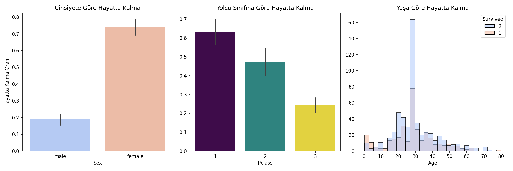
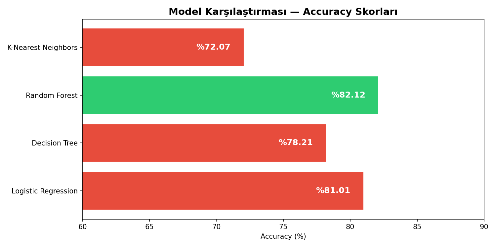
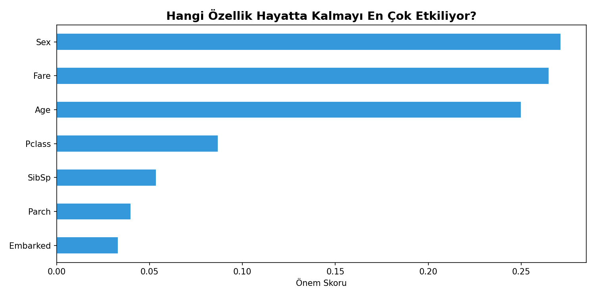
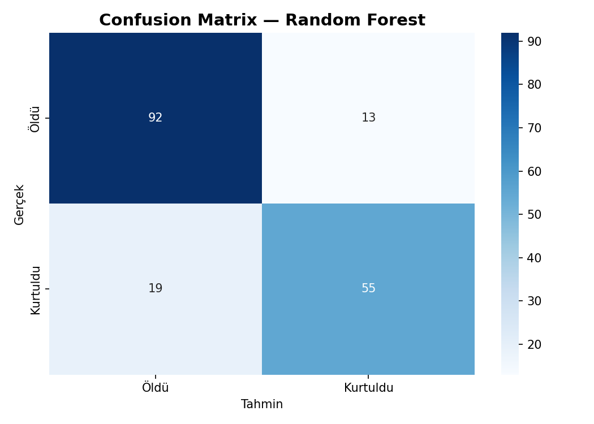

# 🚢 Titanic Survival Prediction — ML Classification

A machine learning project that predicts Titanic passenger survival using 4 different classification algorithms, with feature engineering, model comparison, and an interactive survival predictor.

## 🎯 Project Overview

The sinking of the Titanic is one of history's most infamous disasters. This project builds predictive models to answer: **given a passenger's profile, can we predict whether they survived?**

Beyond basic modeling, this project explores *why* certain passengers were more likely to survive — uncovering the role of gender, class, and wealth in survival outcomes.

## 📊 Dataset

- **Source**: [Titanic Dataset](https://www.kaggle.com/c/titanic) via datasciencedojo
- **Size**: 891 passengers, 12 features
- **Target**: `Survived` (0 = died, 1 = survived)

## 🔍 Key Findings

### Survival Analysis
| Factor | Finding |
|---|---|
| Gender | Women survived at 75% vs men at 19% |
| Class | 1st class: 63% survival, 3rd class: 25% survival |
| Most influential feature | Sex (by Random Forest importance score) |
| 2nd most influential | Fare — wealth was a survival factor |

### Model Performance

| Model | Accuracy |
|---|---|
| **Random Forest** ✅ | **82.12%** |
| Logistic Regression | 81.01% |
| Decision Tree | 78.21% |
| K-Nearest Neighbors | 72.07% |

**Random Forest** achieved the best performance with **82.12% accuracy** — competitive with top Kaggle submissions on this dataset.

## 🖼️ Visualizations

### Survival Rate by Gender, Class & Age


### Model Comparison


### Feature Importance — What Predicted Survival Most?


### Confusion Matrix — Random Forest


## 🤖 Interactive Survival Predictor

The notebook includes a function to predict survival probability for any passenger profile:

```python
# Would you have survived?
hayatta_kalir_miydin(cinsiyet="male", yas=22, sinif=3, ucret=8)
# ❌ NE YAZIK... Hayatta kalma olasılığın: %1.0

hayatta_kalir_miydin(cinsiyet="female", yas=22, sinif=1, ucret=100)
# ✅ HAYATTASINكان! Hayatta kalma olasılığın: %100.0
```

## 🛠️ Tech Stack

- **Python 3.14**
- **Pandas** — data loading and preprocessing
- **Scikit-learn** — ML models, train/test split, evaluation metrics
- **Matplotlib / Seaborn** — visualizations
- **Jupyter Notebook** — interactive analysis

## 📋 ML Pipeline

```
Raw Data → Data Cleaning → Feature Engineering → Train/Test Split
    → Model Training (4 models) → Evaluation → Best Model Selection
```

### Data Preprocessing Steps
1. **Missing values**: Age filled with median, Embarked with mode
2. **Dropped columns**: Cabin (68% missing), Name, Ticket, PassengerId
3. **Encoding**: Label encoding for Sex and Embarked
4. **Split**: 80% train / 20% test (random_state=42)

## 🚀 How to Run

```bash
git clone https://github.com/Yusufemreglr/titanic-ml.git
cd titanic-ml

pip install pandas matplotlib seaborn scikit-learn jupyter

jupyter notebook titanic_ml.ipynb
```

## 📁 Project Structure

```
titanic-ml/
│
├── titanic_ml.ipynb              # Main notebook
├── titanic.csv                   # Dataset
├── hayatta_kalma_analizi.png     # Survival analysis chart
├── model_karsilastirma.png       # Model comparison chart
├── feature_importance.png        # Feature importance chart
├── confusion_matrix.png          # Confusion matrix
└── README.md
```

## 👤 Author

**Yusuf Emre Güler**  
Computer Engineering Student — Konya Technical University  
[GitHub](https://github.com/Yusufemreglr) · [LinkedIn](https://linkedin.com/in/yusufemreglr)
